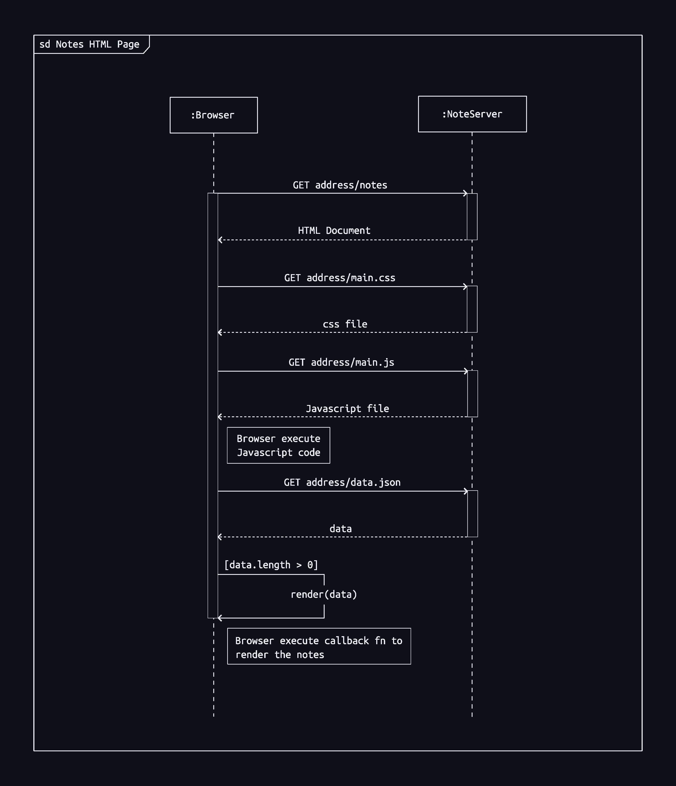
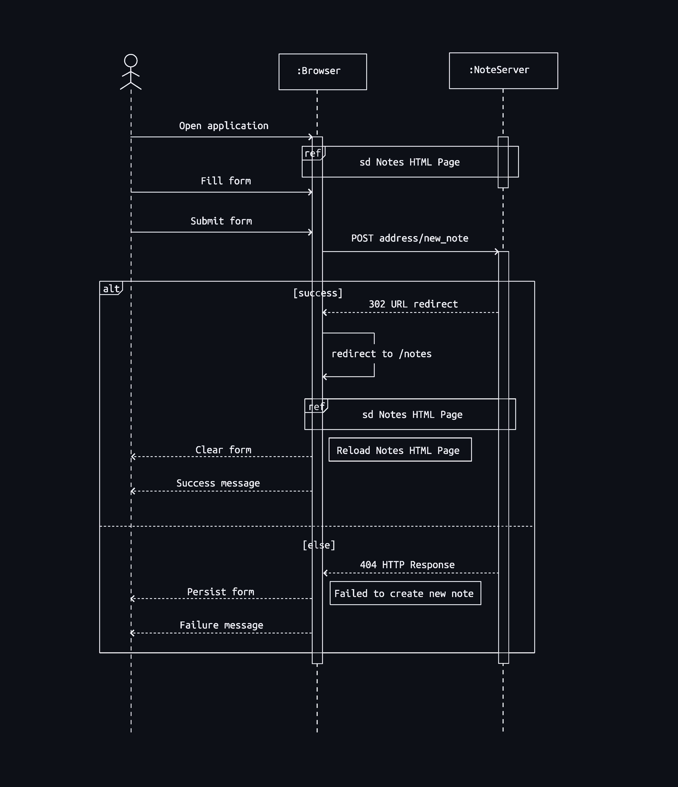

Excercise 0.4: New note diagram

## Sequencial Diagram for adding new notes

The process of creating new note can be divided into three main sections/actions accouring between the client (browser) and the server (noteServer).

1. [Initial load of the note page containing javascript file](#1-initial-loading-of-the-note-page-containing-javascript-file)
2. [Creating new note after full page load](#2-creating-new-note-after-full-page-load)
3. [Reload of the notes page after note creation](#3-reload-of-the-notes-page-after-note-creation)

### 1. Initial loading of the note page containing javascript file

When the page containing javascript is loaded, the browser fetches the HTML code defining the content and the structure of the page from the server using an HTTP GET request. Links in the HTML code cause the browser to also fetch the CSS style sheet (main.css) and the  JavaScript code file (main.js). The browser executes the JavaScript code. The code makes an HTTP GET request to the address <https://studies.cs.helsinki.fi/exampleapp/data.json>, which returns the notes as JSON data. When the data has been fetched, the browser executes an event handler, which renders the notes to the page using the DOM-API.

 
 

 
 

figure 1.0: Sequencial diagram for notes html page load

### 2. Creating new note after full page load

In the situation where the user creates a new note on the page <https://studies.cs.helsinki.fi/exampleapp/notes>, the user interact with the client (browser); user fills in the Form and submit the note to the server (noteServer). Since the Form tag has attributes action and method, which define that submitting the Form is done as an HTTP POST request to the address _new\_note_, the client (browser) makes an HTTP POST request to the address <https://studies.cs.helsinki.fi/exampleapp/new_notes> upon Form submission. The request body contains the data for the new note to be created.

After successfull creation of note, the server responds with HTTP status code 302.

### 3. Reload of the notes page after note creation

The response from the server (HTTP status code 302) is a URL redirect, with which the server asks the browser to do a new HTTP GET request to the address defined in the header's Location - the address _notes_. So, the browser reloads the Notes page. The reload causes three more HTTP requests: fetching the style sheet (main.css), the JavaScript code (main.js), and the raw data of the notes (data.json) [[1]](#1-initial-loading-of-the-note-page-containing-javascript-file).

 
 

 
 

figure 2.0: Sequencial diagram for creation of new note

---
For a full new note sequencial diagram created using mermaid, please see [new note sequencial diagram](sequencial-diagram/new-note-diagram.md)

