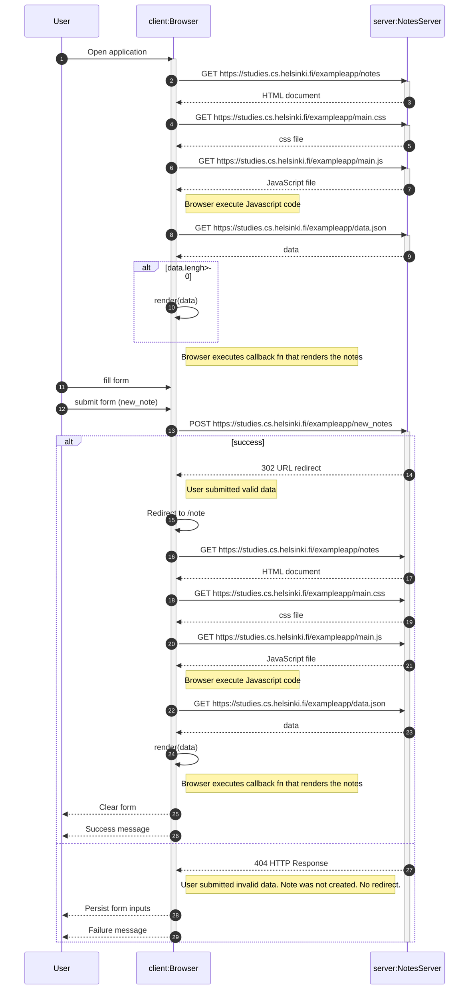

```mermaid
sequenceDiagram
    participant User
    participant browser as client:Browser
    participant server as server:NotesServer

    autonumber

    User->>browser: Open application
    activate browser
    browser->>server: GET https://studies.cs.helsinki.fi/exampleapp/notes
    activate server
    server-->>browser: HTML document
    deactivate server

    browser->>server: GET https://studies.cs.helsinki.fi/exampleapp/main.css
    activate server
    server-->>browser: css file
    deactivate server

    browser->>server: GET https://studies.cs.helsinki.fi/exampleapp/main.js
    activate server
    server-->>browser: JavaScript file
    deactivate server

    Note right of browser: Browser execute Javascript code

    browser->>server: GET https://studies.cs.helsinki.fi/exampleapp/data.json
    activate server
    server-->>browser: data
    deactivate server

    alt data.lengh>0
        browser->>browser: render(data)
    end

    Note right of browser: Browser executes callback fn that renders the notes

    User->>browser: fill form
    User->>browser: submit form (new_note)
    browser->>server: POST https://studies.cs.helsinki.fi/exampleapp/new_notes
    activate server

    alt success
        server-->>browser: 302 URL redirect

        Note right of browser: User submitted valid data

        browser->>browser: Redirect to /note
        browser->>server: GET https://studies.cs.helsinki.fi/exampleapp/notes
        server-->>browser: HTML document
    

        browser->>server: GET https://studies.cs.helsinki.fi/exampleapp/main.css
        server-->>browser: css file

        browser->>server: GET https://studies.cs.helsinki.fi/exampleapp/main.js
        server-->>browser: JavaScript file
   
        Note right of browser: Browser execute Javascript code

        browser->>server: GET https://studies.cs.helsinki.fi/exampleapp/data.json
        server-->>browser: data
        browser->>browser: render(data)
    
        Note right of browser: Browser executes callback fn that renders the notes

        browser-->>User: Clear form
        browser-->>User: Success message
    else
        server-->>browser: 404 HTTP Response
        
        Note right of browser: User submitted invalid data. Note was not created. No redirect.
        
        browser-->>User: Persist form inputs
        browser-->>User: Failure message
    end   

    deactivate server
    deactivate browser

```
