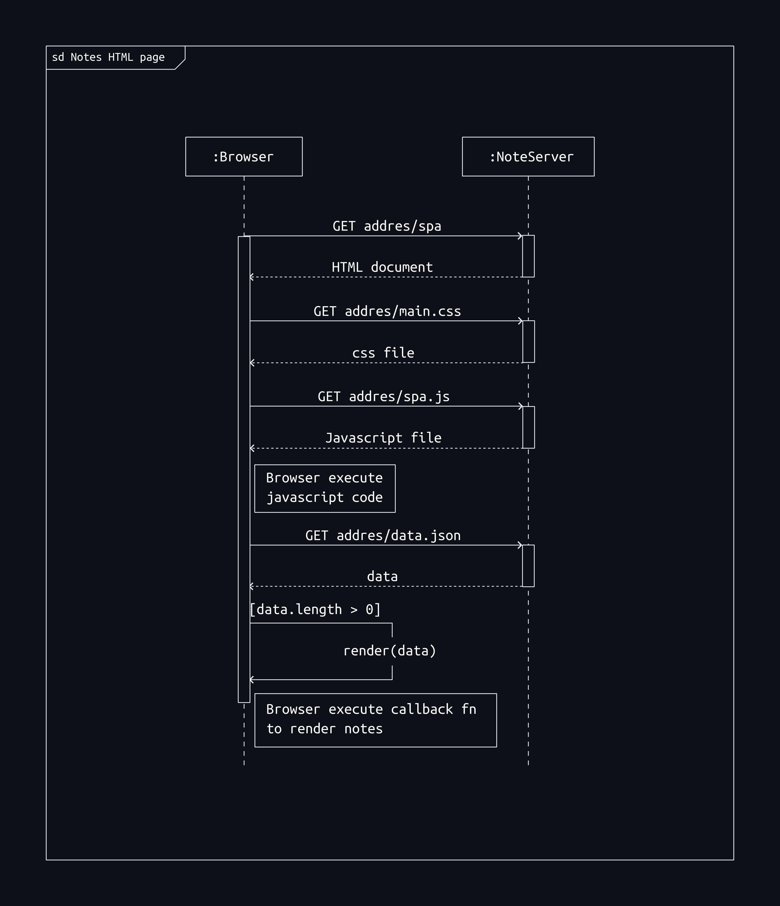

Exercise 0.5: Single page app diagram

### Loading a single page app

---

The initial loading of the single page app when a user visit the page has no difference with initial load of the traditional website/Multipage app. The first load makes an HTTP request to the server which will return a series of assets and javascript and a minimal HTML structure (usually only the root node). The client (browser) will take care of interpreting and rendering the DOM via javascript. Since SPA contains javascript, when it is loaded, the browser fetches the HTML code defining the content and the structure of the page from the server using an HTTP GET request. Links in the HTML code cause the browser to also fetch the CSS style sheet (main.css) and the JavaScript code file (spa.js). The browser executes the JavaScript code. The code makes an HTTP GET request to the address <https://studies.cs.helsinki.fi/exampleapp/data.json>, which returns the notes as JSON data. When the data has been fetched, the browser executes an event handler, which renders the notes to the page using the DOM-API.

 
 

 

figure 1.0 Sequencial diagram for a single page app
