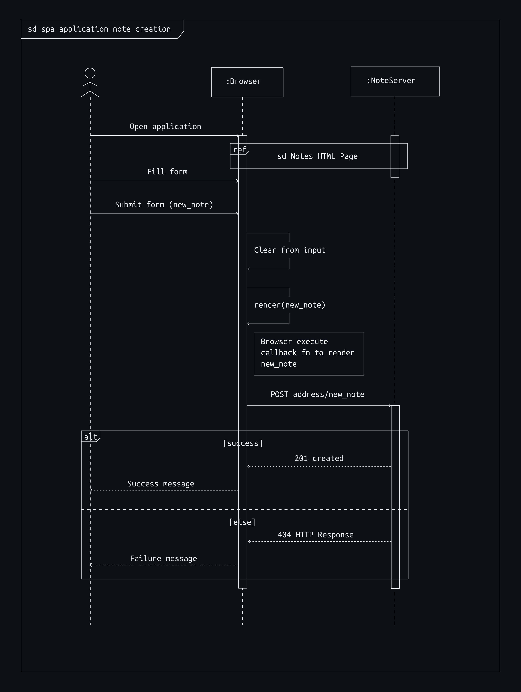

Exercise 0.6: New note in Single page app diagram

### New note in SPA
In SPA, browser uses the javascript code retrived from the server to manipulate the DOM. Since the form in the SPA has no action attribute, when submitting the form no POST request will be sent to the server, instead the browser execute the callback function in the javascript file (spa.js) which renders the new note to the screen, clear the form input and sends the POST request to <https://studies.cs.helsinki.fi/exampleapp/new_note_spa>. When the request succeed, the server respond with a status 201 created and succes message. The whole process does not trigger any GET request hence no url redirects or page reload during note creation in SPA.

 
 

 